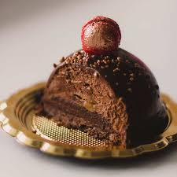

 

Pudding is a favorite dessert, snack and treat for a lot of people. Flavors include vanilla, chocolate, rice, tapioca and butterscotch. It also has nutritional value, such as calcium and vitamin D. In the United States, the  pudding  you  know and love is more like custard. Custards have a thick  consistency  and  rich flavor. Other  countries, like  England, use pudding as a savory dish. If you're like most people in America, you enjoy the instant, dry mix and ready-to-eat puddings sold in grocery stores. They're easy to make and serve. However, they're not  all the same. Some  have  better  nutrition than others. This is a nutritional guide to America's favorite sweet dessert and what you  should  look  out  for  before buying pudding.

# Ingredients of Pudding

<ul> 
<li>120 gm refined flour</li>
<li>175 gm bread crumbs</li>
<li>250 gm unsalted butter</li>
<li>3 gm salt</li>
<li>85 gm almonds</li>
<li>1 teaspoon lime zest</li>
<li>300 gm apple</li>
<li>5 gm baking powder</li>
<li>5 gm 5 spice powder</li>
<li>175 gm brown sugar</li>
<li>250 gm mixed dry fruits</li>
<li>2 egg</li>
<li>100 ml brandy</li>
<li>100 ml milk</li>
</ul>

# Recipe of Pudding 

### Step 1 : Make flour mixture
 To prepare this recipe, **sieve flour then mix baking powder, breadcrumbs and spices. Add dry fruits (lemon peels, orange peels, black currant, raisin, cashew, walnut, tutti frutti-chopped), apple, almonds peeled and chopped & lemon zest and mix well.** Keep aside.

### Step 2 : Prepare batter for pudding
 Take another bowl, mix butter, salt and brown sugar till sugar dissolve completely. Add **eggs, milk and brandy.** Then slowly mix both mixtures till smooth inconsistency.

### Step 3 : Bake pudding at 120 degrees C
 To bake the pudding, grease the 5 **(250 gms each)** pudding moulds, fill this mixture and cover with cling wrap. Cook these moulds in a double boiler in the oven at the temperature **120 degrees C for two hours.** Once baked cool it down at room temperature then keep in the cold storage. Dust with icing sugar before serving.

### Tips :
 Serve this heart dessert with some **ice cream and caramel sauce to make a platter.**
 To make it more yummy you can add in some fresh custard sauce.To make it more yummy you can add in some fresh custard sauce.

**[More about pudding](https://recipes.timesofindia.com/recipes/holiday-pudding/rs73079587.cms)**

